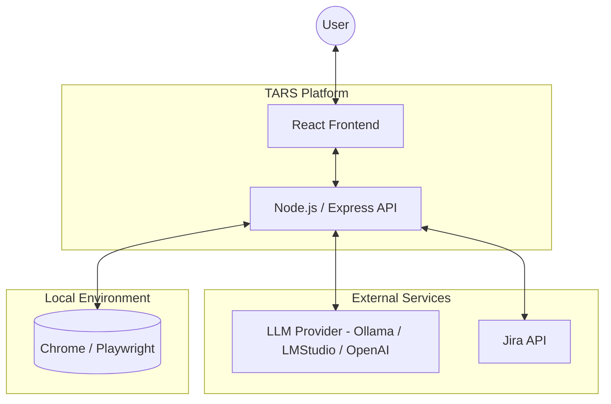
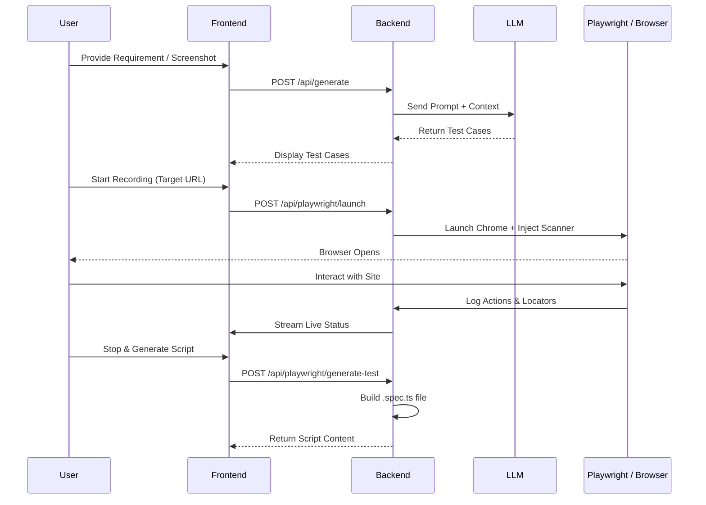

# TARS Architecture Overview

TARS (**Test Automation & Reporting Suite**) is an AI-driven platform designed to streamline the software quality assurance lifecycle. It integrates LLM-based test case generation, browser-based automation recording via Playwright, and seamless reporting with Jira.

## System Architecture

The following diagram illustrates the high-level architecture of TARS and its interaction with external services.

---

## Component Breakdown

### 1. Frontend (React + Vite)
- **Dashboard**: Visualizes test metrics and trends using Recharts.
- **Test Generator**: UI for submitting Jira requirements and screenshots for AI analysis.
- **Automation Recorder**: Controls for launching the browser, monitoring locators, and generating Playwright scripts.
- **Jira Integration**: Interface for reporting defects directly from test results.

### 2. Backend (Express API)
- **LLM Routes**: Orchestrates prompts for test case generation. Supports image analysis (Vision) for UI-to-Test workflows.
- **Playwright Routes**: 
    - Manages the singleton browser session.
    - **Locator Discovery**: Injects a custom DOM scanner to identify stable Playwright locators (`data-testid`, ARIA roles, etc.).
    - **Action Recorder**: Tracks user interactions (clicks, navigation, text entry) to build test scripts.
- **Jira Routes**: Handles authentication and defect creation logic.
- **Salesforce Routes**: Specialized logic for Salesforce-specific UI patterns and test templates.

### 3. Automation Engine (Playwright)
- Executes in the local environment to provide "Headed" recording and automation.
- Discovers locators in real-time during manual exploration to assist in script generation.

---

## End-to-End Flow: Test Generation & Recording

This sequence diagram shows how a user goes from a requirement to a generated automation script.

---

## Technical Stack

- **Frontend**: React 19, Vite, Tailwind CSS, Recharts.
- **Backend**: Node.js, Express 5.
- **Automation**: Playwright (Chromium/Chrome).
- **Communication**: REST API (Axios).
- **Reports**: PowerPoint (pptxgenjs), Word (docx), Excel (xlsx).
